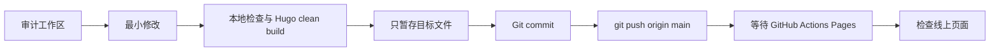

# Agent 工作规则

本文件是本项目后续 Agent 的执行约定，适用于 `/Users/akira/project/blog-of-mine`。

## 沟通与呈现

- 回答简洁明了，先给结论，再给必要的证据和下一步。
- 默认使用短段落和清晰的小标题；避免重复背景、空泛铺垫和过长解释。
- 用户没有要求长篇分析时，优先给出可直接执行的步骤、命令或决策建议。
- 当信息包含流程、层级、状态变化或多项对比时，优先使用 Mermaid 图或 Markdown 表格，再补充简短说明。
- Mermaid 只表达关键关系；图后附一段简短文字，说明读者应如何理解或执行。
- 表格只保留有助于比较或决策的列，不把普通段落改写成复杂表格。
- 不重复描述用户已经知道的背景；不把未验证的推断写成事实。
- 报告验证结果时明确区分：本地静态检查、Hugo 构建、浏览器检查、GitHub Actions 和线上访问。

## AI 执行方式

- 先阅读本文件，再检查工作区状态和与请求直接相关的文件。
- 先说明结论、影响范围和下一步；需要用户确认的方案先停在方案阶段，不提前修改实现。
- 对日期、发布状态、线上部署等容易混淆的概念，使用明确字段和实际证据，不凭感觉补全。
- 最终报告保持短小，只列出已完成事项、验证证据和仍未验证的边界。

## 修改边界

- 修改前先执行 `git status --short --branch`，识别并保留用户已有的未提交改动。
- 只修改完成当前请求所必需的文件；不要使用 `git add .` 吸收无关文件、日志、归档或生成目录。
- `themes/hugo-PaperMod` 是主题子模块；除非用户明确要求，不直接修改主题代码，优先在站点自己的 `layouts/`、`assets/`、`content/` 和配置中覆盖。
- 站点是 Hugo 双语博客；修改共享模板或 CSS 时，同时检查英文和中文输出，并保持语言切换路径有效。

## 每次修改的提交与上线闭环

每一次代码或内容修正都必须及时完成“小提交 → 推送 → 上线验证”，不得把已完成的修正长期留在工作区。



执行要求：

1. 修改后运行 `git diff --check`，并按改动范围执行必要的构建或测试。
2. 只暂存本次修正涉及的文件；提交信息使用清晰、可检索的动词式描述。
3. 提交后立即执行 `git push origin main`，确认 `HEAD` 与 `origin/main` 一致。
4. 推送触发 `.github/workflows/gh-pages.yml`；使用 `gh run list` / `gh run watch --exit-status` 等方式等待结果。
5. Actions 成功后检查线上首页及本次改动涉及的语言页面或路由；若失败，记录失败边界并优先修复后再次提交、推送。
6. 不以“本地构建成功”代替线上部署成功，也不以“已推送”代替页面可达性验证。

## 常用命令

```bash
git status --short --branch
hugo --cleanDestinationDir --minify
git diff --check
git add <本次修改的文件>
git commit -m "<type>: <summary>"
git push origin main
gh run list --workflow gh-pages.yml --limit 5
gh run watch <run-id> --exit-status
```

部署前应确认 Hugo 版本与 workflow 一致（当前为 `0.166.0`），并检查生成目录中没有已删除内容残留。

## 完成报告

最终报告只列出：修改文件、提交和推送结果、本地验证、Actions/线上验证、仍存在的非阻塞警告或未验证边界。
