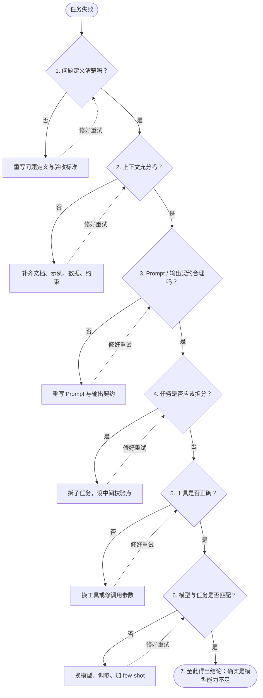

# 从一个暴论出发

最近 GPT 6 系列新出了 `Sol` 和 `Luna`，社区里对此展开了一系列讨论，其中出现了令我惊讶的暴论。起因是不少 GPT Plus/Pro 用户赞叹 `Luna` 的性价比，有人对此却颇为不屑：

1. 如果你有 `Astra` 和 `Sol` 可用，却贪便宜选择`Luna`，那不如不开 Plus/Pro
2. 如果你的问题能被 `Luna` 解决，那就说明你的问题不是个问题

平心而论，一个计算机外行恐怕都说不出如此外行的话（所谓的外行只是客观描述，不带任何褒贬色彩），由于该观点过于缺乏常识，因此没有任何与之讨论的价值。不过由此可以展开一系列针对「**模型编排**」和「**解决问题**」的思考。

从时间维度看，`GPT-6-Luna` 放到哪怕半年前，也是绝对顶尖的模型，难道这就意味着半年前的模型都不值一提、半年前的问题也算不上是问题吗？不止`GPT-6-Luna`，别的模型也能以此类推。

从评分角度看，在 `DeepSWE` 评分上，`GPT-6-Luna` 强于 `GLM-5.3-Flash` 和 `DeepSeek-V4-Pro`，略低于 `GLM-5.3`。要知道，和`Luna`做对比的这 3 个模型在国内已是 T1 梯队。评分确实不能说明一切问题，但它也绝非一纸空文。

从社区反应看，Simmon Willison 在博客 [Claude Opus 5.5, GPT-6 Sol, GPT-6 Luna, and a new price war](https://simonwillison.net/2026/Sep/22/opus-and-sol-and-luna/) 当中明确提过，他前不久的首选 coding 模型是 `GPT-5.6-Luna`，社区对于 Luna 的类似褒扬也不胜枚举。

以上所有，说明了一系列问题：

1. `Luna`比`Astra`和`Sol`弱，不代表`Luna`本身就弱。这里也能插句题外话：一个模型在 A 领域弱，不代表它在别的领域也弱。比如，豆包系列模型综合 coding 能力远低于 GPT，但这不意味着 GPT 做的「XXX 一日游」比豆包更好。
2. 一个人尤其是在公开场合讲的话，要有多维度的事实做依据，否则就是不负责，而责任意识是个人能力的重要体现。这句话乍一听有些苛刻：说句话也需要精密如机器吗？其实不然，**只要知识储备足量、思维能力在线，那么无需费力思索，讲出来的话在各个维度上都不会太离谱**。

# LLM 为何要强弱搭配

那么既然我们有更强的 `Astra`和`Sol`可用，为何要选择 `Luna`呢？最显而易见的原因是成本，其次则是「无脑氪金」这一行为对于自身能力会产生负面影响。

## 成本考量

假设我们的银行卡/企业提供的额度深不见底，整个项目 all in 最强模型**或许是局部最优解，但不见得是全局最优解**。这里就涉及到了金钱以外的时间和精力成本：

1. 时间成本
   通常情况下，更强的模型意味着更长的推理链路，这也导致模型响应更慢，对于改字段或补测试这类任务而言，额外的推理基本没有收益。
2. 精力成本
   强模型能看到更多的潜在问题，但要知道，模型无论如何都是能挑出问题的，而其中真正值得投入精力去解决的，恐怕不占 1%。在这种情况下，我们把脑子交出去，只会让项目愈发臃肿；要想避免臃肿和冗余，就得投入精力去和模型 battle，收敛它的过度设计。

## 上交脑子的负面影响

如果遇到问题解决不了，或者解决不好，第一反应是选用更强的模型，而非梳理自己的**业务理解**和**工程设计**，非但不利于根本上解决问题，还会退化自己的思维和工程能力。那在这种情况下应该怎样做才好呢？以下是一条我总结出来的推断链路：

# 什么是解决问题

所谓解决问题，描述的不只是结果，也是过程。

解决一个问题，耗费了多少时间、精力、金钱，以及机会成本？最终的收益和成本均衡吗？所有这些，都是解决问题的重要考量因素。如果问题解决的过程笨、效果差，那恐怕不如不去解决。
