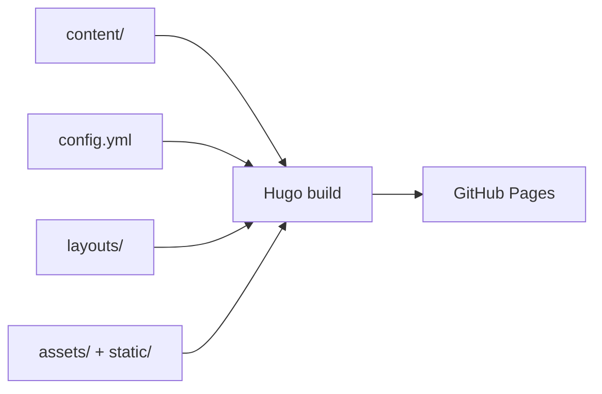

# DiKi 项目架构与 Agent 路由

## 文档定位

本文档是项目当前架构的事实入口。它描述工作区中已经存在的结构和契约，不记录尚未实现的规划。修改目录、内容模型、双语策略或部署方式时，应同步检查本文档。

## 文档层级

| 层级 | 文件 | 负责的问题 |
| --- | --- | --- |
| 执行协议 | `AGENTS.md` | Agent 如何开始、修改、验证和上线 |
| 架构事实 | `docs/architecture.md` | 文件边界、渲染链路、任务路由 |
| 日常使用 | `docs/blog-usage.md` | 如何写文章、预览和发布 |
| 长期决策 | `docs/adr/` | 为什么采用当前双语、主题覆盖和部署策略 |
| 当前上下文 | `.handoff/latest.md` | 最近工作、未完成事项和验证边界 |
| 功能规格 | `specs/<id>/` | 仅用于跨边界且需要验收标准的功能 |

同一事实只保留一个主要来源。其他文件可以放短链接或局部实现注释，但不要复制完整规则。

## 当前系统边界

- `content/posts/` 保存文章；首页、Archive、Tags、Categories、Search 和 RSS 从文章集合生成。
- `content/archives*`, `content/search*`, `content/tags/**/_index*`, `content/categories/_index*` 是路由壳，不是文章目录。
- `config.yml` 定义语言、主 section、taxonomy、输出格式和部署相关站点参数。
- `layouts/` 是站点对 PaperMod 的覆盖层；`themes/hugo-PaperMod` 保持为子模块。
- `assets/` 由 Hugo 处理；`static/` 原样复制到站点根目录；文章专属资源优先放在页面包中。
- `.github/workflows/gh-pages.yml` 使用 Hugo `0.166.0` 清理构建并部署 Pages。

## 内容契约

- 文章只在 `params.canonicalContentLanguage` 指定的语言中撰写；当前值为 `en`。
- 中文站点镜像规范语言的文章集合、标签索引和分类索引，不为同一篇文章再创建一份中文文章。
- 常用 Front Matter：`title`、`date`、`lastmod`、`description`、`categories`、`tags`、`draft`。
- `categories` 通常填写一个大类；分类总览的卡片直接展开规范语言文章链接，确保新增分类无须手工创建中文 term 路由。
- `date` 表示首次发布时间；内容实质修改时更新 `lastmod`，不要覆盖原始 `date`。
- `description` 用于摘要、搜索和订阅元数据；文章列表和详情页不再单独展示副标题。
- 旧文章中的 `subtitle` 字段可以保留，不需要为了这次展示调整重写文章内容；该字段不再参与页面展示。
- 当前规范标签为 `个人思考` 和 `技术文档`。标签按字面匹配，新增标签应先确认是否需要扩展规范。
- `draft: true` 只在本地 `hugo server -D` 中预览，Pages 工作流不会部署草稿。
- Hugo `0.166.0` 的增量预览可能缓存分类总览。仅在 `hugo server` 中，分类页会在浏览器刷新时读取规范语言文章页最新的 `categories`，重建中英文可展开卡片；普通构建仍使用 Hugo 原生 taxonomy 生成静态卡片。预览文章页的分类数据来自同一 Front Matter 字段。

## 渲染契约

- 首页、普通列表、Tags 和 Archive 使用站点的 `layouts/partials/article_card.html`；Categories 总览使用可展开卡片，在每篇文章行显示标题、正文摘要、发布日期和 Tags。两处文章列表的摘要共用 `layouts/partials/article_excerpt.html`。`layouts/_default/terms.html` 只在本地服务中加载 `static/js/category-preview.js`，以弥补 Hugo 增量构建对总览的缓存；脚本重建的文章行保持同样的信息结构。
- `layouts/_default/index.json` 是搜索索引；英文和中文搜索页查询同一规范语言文章集合。
- `layouts/_default/rss.xml` 生成首页、section 和 taxonomy feeds；首页双语 feed 都基于规范语言文章。
- 语言切换由站点顶部导航处理；页头在解析到导航后立即应用已保存的显示语言，并同步更新菜单链接到所选语言的路径。不要在新页面中重复创建一套语言选择器。
- 顶部导航在宽度不超过 480px 时分两行显示：第一行是站点标题和切换按钮，第二行完整显示 Articles／文章、Search／搜索、Categories／专栏，正文顶部留出对应高度。
- 站点主内容宽度为 810px，按 18px 正文字号约容纳每行 45 个全角汉字；导航宽度与主内容保持一致，窄屏继续受视口限制。
- 中英文专栏总览只显示页面标题和分类卡片，不显示标题下的说明文案。
- 文章标题、摘要、日期和标签仍由原有模板分别渲染；本次只移除副标题展示路径。
- 文章正文的 H1–H6 沿用 PaperMod 的标题锚点；鼠标悬停标题行时，站点样式在标题后显示对应数量的浅色 `#`，提示标题层级。文章页主标题不使用此提示。
- 文章正文 H1/H2 的 32px/27px 字号由站点 `assets/css/extended/custom.css` 覆盖，避免依赖主题子模块工作区中的未提交修改。
- 普通代码围栏由 `layouts/_default/_markup/render-codeblock.html` 包装为站点代码块面板，底层仍使用 Hugo Chroma；`mermaid` 语言继续由 `render-codeblock-mermaid.html` 单独处理。
- `config.yml` 使用 `markup.highlight.noClasses: false` 和 `lineNos: inline` 输出 Chroma class 与行号；`assets/css/extended/custom.css` 负责面板、浅色/深色主题和行号视觉，`static/js/code-blocks.js` 负责复制与换行切换。
- LaTeX 通过 Goldmark passthrough 捕获，使用 `layouts/_markup/render-passthrough.html` 调用 Hugo 内置 KaTeX，输出 HTML + MathML；KaTeX CSS 在包含文章内容的页面中按需加载。

## Agent 任务路由

| 任务 | 先读 | 常见修改范围 | 最小验证 |
| --- | --- | --- | --- |
| 新增或修改文章 | `docs/blog-usage.md`、`archetypes/posts.md` | `content/posts/`、页面包 | Front Matter、草稿状态、目标语言 |
| 标签、分类、搜索、RSS | 本文“内容契约”和 `docs/adr/ADR-002-content-language-and-taxonomy.md` | `config.yml`、`layouts/_default/`、`layouts/partials/` | 英文/中文路由与输出格式 |
| 卡片、Archive、导航 UI | 本文“渲染契约” | `layouts/`、`assets/css/extended/`、`i18n/` | 所有文章列表和双语页面 |
| 主题行为 | `docs/adr/ADR-003-theme-overrides-and-deployment.md` | 站点 `layouts/`、`assets/` | 子模块未被修改 |
| 发布或 Pages 故障 | `AGENTS.md`、`.github/workflows/gh-pages.yml`、`.handoff/latest.md` | workflow、配置或受影响页面 | clean build、Actions、线上路由 |
| 复杂新功能 | 本文、相关 ADR、`.handoff/latest.md` | `specs/<id>/` 加实现文件 | 按 Spec 的验收条件 |

## 当前限制

- 本仓库没有独立运行时服务或数据库；不需要为普通博客文章创建数据库类 ADR。
- `public/`、`.hugo_build.lock` 和 `resources/_gen/` 属于生成或本地状态，不应被普通修改吸收。
- 线上状态、Actions 结果和当前工作区状态具有时效性；必须现场检查，不能只引用旧 handoff。
