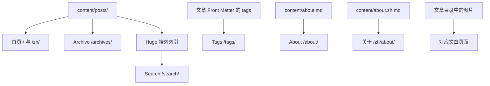

# DiKi 博客使用说明

## 1. 新增一篇文章

把 Markdown 文件放在：

```text
content/posts/
```

最简单的文章结构：

```text
content/posts/my-first-post.md
```

推荐使用页面包，以便把封面图和文章资源放在一起：

```text
content/posts/my-first-post/
├── index.md
└── cover.jpg
```

`index.md` 示例：

```markdown
---
title: "My First Post"
date: 2026-09-20
description: "A short description shown in lists and search."
tags: ["notes", "life"]
draft: false
---

正文写在这里。


```

文章满足以下条件后，会出现在首页和 Archive：

- 文件位于 `content/posts/` 下；
- 正式文章建议使用 `draft: false`；本地预览草稿使用 `hugo server -D`；
- `date` 不晚于当前日期；
- `date` 保留首次发布时间；文章发生实质性修改时增加或更新 `lastmod`，不要覆盖原来的 `date`；
- 没有被设置为隐藏。

注意：当前 GitHub Pages 工作流带有 `--buildDrafts`，所以 `draft: true` 的文件也会被部署。不要把尚未准备公开的草稿放在会被推送的内容目录中，或在以后调整工作流的草稿策略。

文章的 `tags` 不需要单独建文件。Tags 页面会自动从文章 Front Matter 中的 `tags` 字段生成。

### 发布日期与修订日期

文章详情页会保留首次发布时间，并在 `lastmod` 晚于 `date` 时显示修订日期：

```yaml
date: 2026-09-22
lastmod: 2026-09-24
```

页面显示为“发布于：2026-09-22 Tuesday · 修订于：2026-09-24 Thursday”。如果两者是同一天，页面只显示发布日期，避免制造无意义的更新时间信息。首页和 Archive 仍按发布日期组织文章，保持历史顺序稳定。

### 标签怎么写

`tags` 是一个列表；一篇文章可以有一个或多个标签。当前博客预设了两个规范标签：

- `个人思考`：经验、观察、复盘和个人判断；
- `技术文档`：技术实践、配置、排障和操作记录。

例如：

```yaml
tags: ["技术文档"]
```

一篇文章同时属于两类时可以这样写：

```yaml
tags: ["个人思考", "技术文档"]
```

标签名称按字面匹配，建议直接复用上面两个名称，不要混用同义词或不同大小写。标签不是必填项；没有合适标签时可以保留 `tags: []`。

新文章可以用以下命令生成模板，模板会带上标签填写提示：

```bash
hugo new posts/my-first-post.md
```

Hugo/PaperMod 本身不会提供编辑器下拉框；这里的“预设”是通过 taxonomy term 页面和 archetype 统一规范标签名称。标签页可以提前访问，但只有实际给文章填写某个标签后，该标签下才会出现文章。

## 2. 哪些页面由文章自动生成

同一篇文章会自动参与：

| 页面 | 来源 |
| --- | --- |
| 首页 `/`、`/zh/` | `content/posts/` 下的文章 |
| Archive `/archives/`、`/zh/archives/` | 文章日期和文章集合 |
| Tags `/tags/`、`/zh/tags/` | 每篇文章的 `tags` |
| Search `/search/`、`/zh/search/` | Hugo 生成的站点搜索索引 |

不要把文章放入 `content/archives.md`、`content/search.md` 或 Tags 页面；这些文件是站点路由壳，不是文章目录。

顶部的 `RSS` 入口会随当前语言切换到对应订阅源：英文为 `/index.xml`，中文为 `/zh/index.xml`。订阅阅读器也可以直接添加这两个地址。

## 3. 修改 About 页面

About 是站点本体页面，不属于文章：

```text
content/about.md       # English: /about/
content/about.zh.md    # 中文: /zh/about/
```

目前两个文件都只保留了干净的页面入口。你可以分别把英文和中文介绍写入对应文件。不要把个人文章放进 About 文件。

## 4. 图片和其他资源放哪里

- 只给某一篇文章使用的图片：放在该文章目录旁边，例如 `content/posts/my-first-post/cover.jpg`；
- 全站都会使用的资源：放在 `assets/`，由 Hugo 处理；
- 需要原样复制到网站根目录的文件：放在 `static/`。

优先把文章图片放进对应的页面包，不要把文章图片混放在全局目录中。

## 5. 本地预览与发布

本地预览：

```bash
hugo server
```

需要预览草稿时：

```bash
hugo server -D
```

发布流程：

```bash
git add .
git commit -m "feat: add a post"
git push origin main
```

推送到 `main` 后，GitHub Actions 会自动执行 Hugo 构建并部署 GitHub Pages。部署前会清理旧的输出目录，避免已经删除的文章重新出现在网站上。

## 6. 文件到页面的关系



记住最重要的一点：新增文章只放进 `content/posts/`；不要修改 Archive、Search 或 Tags 路由文件来“添加文章”。
