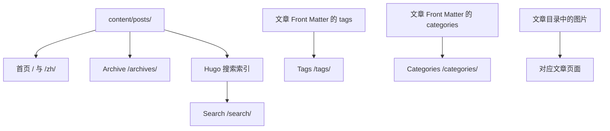

# DiKi 博客使用说明

## 1. 新增一篇文章

把 Markdown 文件放在：

```text
content/posts/
```

最简单的文章结构：

```text
content/posts/my-first-post.md
```

推荐使用页面包，以便把封面图和文章资源放在一起：

```text
content/posts/my-first-post/
├── index.md
└── cover.jpg
```

`index.md` 示例：

```markdown
---
title: "My First Post"
date: 2026-09-20
lastmod: 2026-09-20
description: "A short description used by search and feeds."
categories: ["技术"]
tags: ["技术文档"]
draft: false
---

正文写在这里。


```

文章只在 `config.yml` 的 `params.canonicalContentLanguage` 指定的规范语言中撰写；当前为英文。中文入口会镜像文章索引、标签、搜索和 RSS，不要为同一篇文章再创建一份中文文章。

文章满足以下条件后，会出现在首页和 Archive：

- 文件位于 `content/posts/` 下；
- 正式文章建议使用 `draft: false`；本地预览草稿使用 `hugo server -D`；
- `date` 不晚于当前日期；
- `date` 保留首次发布时间；文章发生实质性修改时增加或更新 `lastmod`，不要覆盖原来的 `date`；
- 没有被设置为隐藏。

注意：GitHub Pages 工作流不构建草稿，`draft: true` 的文件不会被部署。尚未准备公开的文章保持 `draft: true` 即可，发布时改为 `draft: false`。

文章的 `tags` 不需要单独建文件。Tags 页面会自动从文章 Front Matter 中的 `tags` 字段生成。

### 栏目怎么写

在 Front Matter 的 `categories` 中填写文章所属的大类，通常每篇选一个；`tags` 可填写多个细节标签：

```yaml
categories: ["技术"]
tags: ["Hugo", "排障"]
```

新栏目由文章的 `categories` 字段自动产生，不需要另建栏目文件。导航中的 Categories／专栏页面会列出已有栏目；展开栏目卡片即可看到每篇文章的标题、正文开头摘要、发布日期和 Tags。中英文入口读取同一篇规范语言文章，因此新栏目在两个入口都会出现。没有任何文章填写 `categories` 时，栏目页显示空状态。分类名称按字面匹配，请保持拼写一致。

在 `hugo server` 运行时，保存文章的 `categories` 后刷新 `/categories/` 或 `/zh/categories/`，就能看到专栏和文章归属变化，无需重启服务。Hugo `0.166.0` 有时会缓存总览 HTML；本地预览页会读取最新文章页并更新卡片。正式静态构建仍直接使用 Hugo taxonomy；如果浏览器禁用 JavaScript，本地总览可能暂时显示缓存内容。

### 发布日期与修订日期

文章详情页会保留首次发布时间，并在 `lastmod` 晚于 `date` 时显示修订日期：

```yaml
date: 2026-09-22
lastmod: 2026-09-24
```

页面显示为“发布于：2026-09-22 Tuesday · 修订于：2026-09-24 Thursday”。如果两者是同一天，页面只显示发布日期，避免制造无意义的更新时间信息。首页和 Archive 仍按发布日期组织文章，保持历史顺序稳定。

### 标签怎么写

`tags` 是一个列表；一篇文章可以有一个或多个标签。当前博客预设了两个规范标签：

- `个人思考`：经验、观察、复盘和个人判断；
- `技术文档`：技术实践、配置、排障和操作记录。

例如：

```yaml
tags: ["技术文档"]
```

一篇文章同时属于两类时可以这样写：

```yaml
tags: ["个人思考", "技术文档"]
```

标签名称按字面匹配，建议直接复用上面两个名称，不要混用同义词或不同大小写。标签不是必填项；没有合适标签时可以保留 `tags: []`。

### 代码块

普通代码围栏使用 Hugo Chroma 高亮，并自动显示语言名称、行号、复制按钮和自动换行按钮：

````markdown
```python {title="demo.py"}
print("hello")
```
````

`title` 或 `filename` 可以覆盖顶部显示的语言名称；不填写时使用代码围栏的语言标识。复制按钮会排除左侧行号。`mermaid` 围栏仍按图表处理，不显示普通代码块工具栏。

新文章可以用以下命令生成模板，模板会带上标签填写提示：

```bash
hugo new posts/my-first-post.md
```

Hugo/PaperMod 本身不会提供编辑器下拉框；这里的“预设”是通过 taxonomy term 页面和 archetype 统一规范标签名称。标签页可以提前访问，但只有实际给文章填写某个标签后，该标签下才会出现文章。

### 插入 LaTeX 公式

文章支持使用 LaTeX 写数学公式。博客在构建时通过 Hugo 的 Goldmark passthrough 和内置 KaTeX 渲染为 HTML + MathML；KaTeX 样式表使用 Computer Modern 风格的数学字体。

行内公式可以使用 `\(...\)` 或 `$...$`：

```markdown
这是行内公式：\(a^2 + b^2 = c^2\)。
也可以这样写：$a^2 + b^2 = c^2$。
```

如果正文中需要显示普通美元符号，请写成 `\$`，避免被识别为公式。

块级公式可以使用 `$$...$$` 或 `\[...\]`：

```markdown
$$
\int_0^1 x^2\,dx = \frac{1}{3}
$$
```

公式语法错误不会阻止整站构建；KaTeX 会在对应位置显示错误提示。代码块中的 LaTeX 不会被当作公式处理。

## 2. 哪些页面由文章自动生成

同一篇文章会自动参与：

| 页面 | 来源 |
| --- | --- |
| 首页 `/`、`/zh/` | `content/posts/` 下的文章 |
| Archive `/archives/`、`/zh/archives/` | 文章日期和文章集合 |
| Tags `/tags/`、`/zh/tags/` | 每篇文章的 `tags` |
| Categories `/categories/`、`/zh/categories/` | 每篇文章的 `categories`；在页面内展开栏目查看文章 |
| Search `/search/`、`/zh/search/` | Hugo 生成的站点搜索索引 |

不要把文章放入 `content/archives.md`、`content/search.md` 或 Tags 页面；这些文件是站点路由壳，不是文章目录。

顶部的 `RSS` 入口会随当前语言切换到对应订阅源：英文为 `/index.xml`，中文为 `/zh/index.xml`。订阅阅读器也可以直接添加这两个地址。

## 3. 图片和其他资源放哪里

- 只给某一篇文章使用的图片：放在该文章目录旁边，例如 `content/posts/my-first-post/cover.jpg`；
- 全站都会使用的资源：放在 `assets/`，由 Hugo 处理；
- 需要原样复制到网站根目录的文件：放在 `static/`。

优先把文章图片放进对应的页面包，不要把文章图片混放在全局目录中。

## 4. 本地预览与发布

本地预览：

```bash
hugo server
```

需要预览草稿时：

```bash
hugo server -D
```

发布流程：

```bash
git add <本次修改的文件>
git commit -m "feat: add a post"
git push origin main
```

只有收到明确上线指令后才执行提交和推送。推送到 `main` 后，GitHub Actions 会执行 Hugo clean build 并部署 GitHub Pages；本地构建成功不等于线上部署完成。

## 5. 文件到页面的关系


```mermaid
flowchart TD
    Posts[content/posts/] --> Home[首页 / 与 /zh/]
    Posts --> Archive[Archive /archives/]
    TagsField[文章 Front Matter 的 tags] --> Tags[Tags /tags/]
    CategoriesField[文章 Front Matter 的 categories] --> Categories[Categories /categories/]
    Posts --> SearchIndex[Hugo 搜索索引]
    SearchIndex --> Search[Search /search/]
    Assets[文章目录中的图片] --> PostPage[对应文章页面]
```

记住最重要的一点：新增文章只放进 `content/posts/`；不要修改 Archive、Search 或 Tags 路由文件来“添加文章”。
